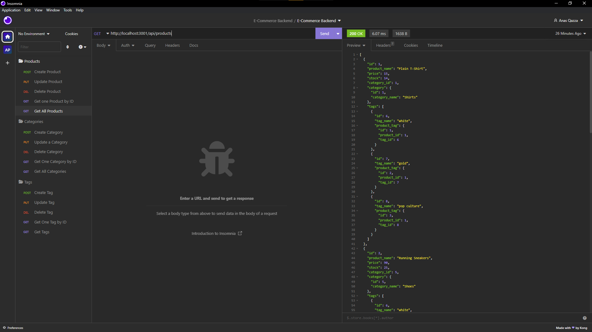

# 11 Express.js: Note Taker

## Table of Contents

[ Description ](#desc)

[ Installation ](#installation)

[ Usage ](#usage)

[ Questions ](#questions)

## 1. Description

This application was created using express js and allows you to configure notes with functions allowing you to get, add, update and delete items from the backend of the E-commerce site.

## 2. Installation

Download my repository before inputting "npm i" to install the neccessary modules

## 3. Usage

Type npm start after creating and seeding the database in the db folder

Used to efficiently track all and specific items in the E-commerce library as well as delete,update, and add categories, products or tags to them.

## 4. Questions

Any questions or comments can be answered using the following

Email:
[anasqazza@gmail.com](mailto:anasqazza@gmail.com)

Github: [Aqazza](https://github.com/aqazza)
